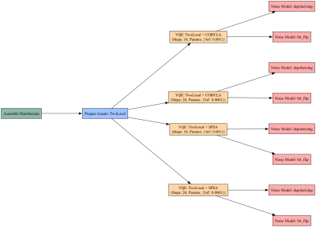
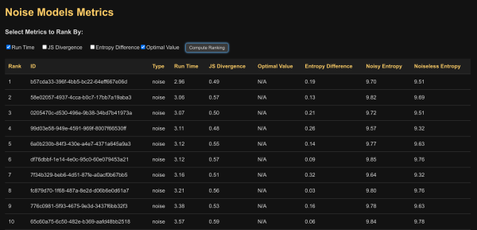
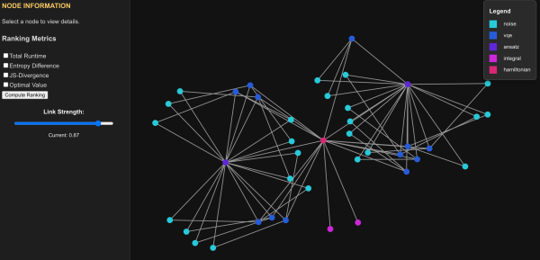
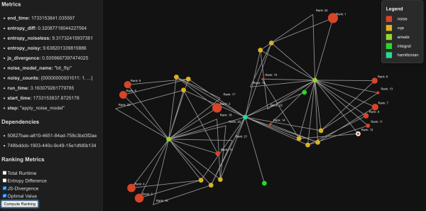

# Distributed Quantum Computing of Electronic Structure with ColonyOS

## Introduction

Significant investments are being made in quantum computing across Europe. A key challenge in this rapidly evolving landscape is the development of frameworks that enable efficient orchestration of quantum computations. These frameworks must ensure that problem formulations are optimized and executed on the most suitable hardware.

## Problem Statement

Researchers and innovators in quantum life sciences, materials sciences etc. require the ability to develop and test algorithms locally on their personal computers before scaling them up to more complex environments. This iterative process involves expanding the algorithm in terms of parameters, noise models, and system complexity. One common approach is to define a grid of hyperparameters, such as:

```python
hyperparam_grid = [
    {
        'optimizer_type': 'COBYLA',
        'optimizer_steps': 50,
        'tol': 1e-3
    },
    {
        'optimizer_type': 'SPSA',
        'optimizer_steps': 50,
        'learning_rate': 0.1
    },
    ...
]
```

Once the optimal configuration is identified, the next step is deploying the algorithm on a quantum computing backend for testing. Researchers also require the ability to collect and analyze data from these computations to build a performance profile across different European compute infrastructures.

## Workflow Design for Quantum Computing

An ideal workflow framework should allow researchers to integrate custom code for calculating integrals and processing required data while enabling parallel execution of interdependent processes. A structured workflow can be defined as follows (in pseudo-code).

Define:

```
    ansatz_types = ['TwoLocal', 'EfficientSU2']
    optimizers = ['COBYLA', 'SPSA']
    hyperparams_list = [{'optimizer_steps': 10, 'optimizer_params': {'tol': 1e-3}}, ... ]
    noise_models = ['depolarizing', 'bit_flip']
```

For each ansatz_type:

```
    Create and append ansatz_spec (function: prepare_ansatz, dependencies: ["assemble_hamiltonian"])
```

For each optimizer:

```
    vqe_dependencies = ["prepare_ansatz_<ansatz_type>"]
    Create nodename_prefix = "run_vqe_<ansatz_type>_<optimizer>"
```

For each hyperparams:

```
    Create and append vqe_spec (function: run_vqe_simulation, dependencies: vqe_dependencies, optimizer: optimizer, hyperparams: hyperparams)
    noise_dependencies = [vqe_spec.node_name]
    Create noise_nodename_prefix = "apply_noise_<vqe_spec.node_name>"
```

For each noise_model:

```
    Create and append noise_spec (function: apply_noise_model, dependencies: noise_dependencies, noise_model: noise_model, ansatz_type: ansatz_type)
```

This structured approach results in a clear dependency chain for each wavefunction ansatz:

```
"assemble_hamiltonian" -> "prepare_ansatz" -> "run_vqe_simulation" -> "apply_noise_model"
```

The Hamiltonian is assembled for the specific system under study, ideally using a flexible approach that allows the calculation of one- and two-electron integrals using preferred computational tools.



## Solution: Leveraging ColonyOS for Distributed Quantum Computing

[ColonyOS](https://ar5iv.labs.arxiv.org/html/2403.16486) is an open-source meta-operating system designed to streamline workload execution across diverse and distributed computing environments, including cloud, edge, HPC, and IoT. This capability makes it well-suited for managing complex, resource-intensive quantum computing tasks. The software is available under the MIT License and can be accessed via GitHub. Comprehensive [tutorial notebooks](https://github.com/colonyos/tutorials) are also available to facilitate onboarding.

### Key Features of ColonyOS

#### 1. Distributed Microservice Architectures

ColonyOS employs a microservices architecture, where independent executors handle specific tasks. This design supports distributed quantum computing by allowing quantum tasks to be executed across geographically dispersed quantum and classical computing resources. Executors can be deployed independently and scaled horizontally, ensuring both efficient parallel processing and fault tolerance.

#### 2. Workflow Orchestration

The platform enables users to define complex, multi-step workflows across distributed executors. This is particularly beneficial for quantum computing applications, which often require iterative execution of quantum circuits, optimization steps (e.g., variational quantum eigensolver (VQE) algorithms), and hybrid quantum-classical computations. ColonyOS manages dependencies and execution sequencing, ensuring seamless operation across diverse computational systems.

#### 3. Scalability and Fault Tolerance

Given the probabilistic nature of quantum computing and the potential for node failures in distributed infrastructures, ColonyOS is designed to reassign tasks dynamically if an executor fails. This fault-tolerant approach minimizes computation disruptions and enhances overall system reliability.

#### 4. Platform-Agnostic Integration

ColonyOS can operate across multiple platforms, including cloud services and HPC environments. This flexibility aligns with the hybrid quantum-classical infrastructures often required for quantum computing, allowing for efficient orchestration of tasks on both classical supercomputers and quantum processors.

#### Summary

The distributed architecture, task orchestration capabilities, scalability, and fault tolerance of ColonyOS make it a powerful solution for managing quantum computing workflows. By leveraging ColonyOS, researchers can efficiently coordinate tasks across quantum and classical computing environments, accelerating the development and deployment of quantum algorithms.

---

## Implementation 

The attempt made in this post is to describe the use of ColonyOS as an orchestrator for quantum computation tasks. The focus is on solving a simpler problem (a water ground state energy calculation) to illustrate the potential of the orchestrator and what it could mean for the distributed aspects of quantum computing.

### What Is Measured to Evaluate the Calculations 

Besides runtimes and ground state energy values generated from the calculations,, estimating how noise affects quantum circuits is important. To evaluate the performance of quantum circuits under noisy conditions, there are numerous metrics that can be used. In the present work the implementation covers Shannon Entropy and Jensen-Shannon Divergence (JSD) as a starting point. A few sections below will be used to elaborate on this using qiskit as a reference.

### Noise Modeling in Qiskit 

Qiskit provides various tools for simulating quantum circuits under various noise models. In this context, two common noise models are employed and described below.

#### 1. Depolarizing Noise Model 

The depolarizing noise model represents a scenario where the quantum state loses its coherence and becomes a completely mixed state with a certain probability. Mathematically, for a single-qubit state \(\rho\), the depolarizing channel \(\mathcal{E}_{\text{dep}}\) is defined as:

$$
\mathcal{E}_{\text{dep}}(\rho) = (1 - p) \rho + p \frac{I}{2}
$$

where \(p\) is the depolarizing probability (error rate) and \(I\) is the identity matrix representing the maximally mixed state.

For multi-qubit systems, the depolarizing channel generalizes by applying the noise independently to each qubit or collectively to the entire system, depending on the model specifics.

In Qiskit, the depolarizing noise is added to quantum gates like single-qubit rotations (u3) and two-qubit gates (cx) using the depolarizing_error function:

<code>
depolarizing_error_1q = noise.depolarizing_error(p, 1)
depolarizing_error_2q = noise.depolarizing_error(p, 2)
>
</code>

In the depolarizing noise model, every gate operation is followed by the application of the depolarizing channel \(\mathcal{E}_{\text{dep}}\) with a specified probability. This simulates the randomization of the qubit state due to interactions with the environment.

For example, after applying a gate \(U\), the state \(\rho'\) becomes:

$$
\rho' = \mathcal{E}_{\text{dep}}(U \rho U^\dagger) = (1 - p) U \rho U^\dagger + p \frac{I}{2}
$$


#### 2. Bit-Flip Noise Model 

The bit-flip noise model simulates the error where a qubit flips its state from \(|0\rangle\) to \(|1\rangle\) or vice versa, akin to a classical bit flip. The bit-flip channel \(\mathcal{E}_{\text{bf}}\) for a single qubit is defined as:

$$
\mathcal{E}_{\text{bf}}(\rho) = (1 - p) \rho + p X \rho X^\dagger ,
$$

where \(X\) is the Pauli-X operator, and \(p\) is the probability of a bit-flip error.

In Qiskit, bit-flip errors are introduced using the pauli_error function:

<code>
bit_flip_error_1q = noise.pauli_error([('X', p), ('I', 1 - p)])
bit_flip_error_2q = noise.pauli_error([('XX', p), ('II', 1 - p)])
</code>

For this model, every gate operation is followed by the application of the depolarizing channel \(\mathcal{E}_{\text{dep}}\) with a specified probability. This simulates the randomization of the qubit state due to interactions with the environment.

For example, after applying a gate \(U\), the state \(\rho'\) becomes:

$$
\rho' = \mathcal{E}_{\text{dep}}(U \rho U^\dagger) = (1 - p) U \rho U^\dagger + p \frac{I}{2}
$$


### Measuring the Impact of Noise 

To quantify how noise affects the quantum circuit, we analyze the output probability distributions of the circuit under noiseless and noisy conditions using the following metrics:

#### Shannon Entropy 

Shannon Entropy measures the uncertainty or randomness in a probability distribution. For a discrete random variable with possible outcomes \(\{x_i\}\) and corresponding probabilities \(\{p_i\}\), the Shannon entropy \(H\) is defined as:

\[ H(X) = -\sum_{i} p_i \log_2 p_i \]

where:

- $$\(H(X)\)$$: The Shannon entropy of the random variable \(X\).
- $$\(p_i\)$$: The probability of the \(i\)-th outcome.
- $$\(\log_2 p_i\)$$: The base-2 logarithm of \(p_i\), reflecting the amount of information in each outcome.

In the context of quantum circuits, the entropy of the output distribution indicates how spread out the measurement outcomes are:

- **Low Entropy**: Concentrated on specific outcomes, implying less uncertainty.
- **High Entropy**: More uniform, indicating higher uncertainty and randomness, often due to noise.

By calculating the entropy of both the noiseless (\(H_{\text{noiseless}}\)) and noisy (\(H_{\text{noisy}}\)) output distributions, we can assess the increase in uncertainty introduced by noise.

#### Jensen-Shannon Divergence (JSD) 

The Jensen-Shannon Divergence is a method of measuring the similarity between two probability distributions. It is a symmetrized and smoothed version of the Kullback-Leibler divergence and is always bounded between 0 and 1 when using log base 2.

For two probability distributions \(P = \{p_i\}\) and \(Q = \{q_i\}\), the JSD is defined as:

$$
\text{JSD}(P \parallel Q) = \frac{1}{2} D_{\text{KL}}(P \parallel M) + \frac{1}{2} D_{\text{KL}}(Q \parallel M)
$$

where

$$
\(M = \frac{1}{2}(P + Q)\) is the average distribution,  \\
\(D_{\text{KL}}(P \parallel M)\) is the Kullback-Leibler divergence from \(P\) to \(M\):
$$

$$
D_{\text{KL}}(P \parallel M) = \sum_{i} p_i \log_2 \left( \frac{p_i}{m_i} \right)
$$


The JSD effectively measures how much the noisy distribution deviates from the noiseless distribution:

- **JSD = 0**: The distributions are identical.
- **Higher JSD Values**: Indicate greater divergence between the distributions due to noise.

#### Applying the Metrics to Evaluate Noise Impact 

By computing the Shannon entropy and JSD for the output distributions, we gain quantitative insights into the noise's effect:

**Entropy Difference $$(\(\Delta H\))$$**:

$$
\Delta H = H_{\text{noisy}} - H_{\text{noiseless}}
$$

**Interpretation:** A positive \(\Delta H\) suggests that noise has increased the uncertainty in the output distribution.\\

**Entropy Ratio:**

$$
\text{Entropy Ratio} = \frac{H_{\text{noisy}}}{H_{\text{noiseless}}}
$$


---


## **Practical Implications of the Metrics**

### Algorithm Performance

Lower entropy difference and Jensen-Shannon Divergence (JSD) values imply that the quantum circuit's performance is closer to the ideal case, with noise having a minimal effect.

### Noise Model Assessment

By comparing metrics across different noise models (e.g., depolarizing vs. bit-flip), we can evaluate which types of noise have more detrimental effects on the circuit.

### Optimization Strategies

Understanding how specific noise types impact the circuit guides the development of error mitigation techniques and circuit optimization.

---

## Ranking and the Calculation Graph

ColonyOS serializes Qiskit objects, metrics, and metadata from each part of the workflow into an SQLite database. This database is then exposed to localhost via a simple Flask API, which connects to a React frontend that presents two key views of the results data.

Both views display the same data and allow ranking across a set of metrics, but they do so in different ways:

### Metrics Table

The metrics table is a simple (in development) table that simply displays each noise simulation computation and data from its related VQE simulation.



### Workflow Graph

The workflow graph shows how each step in the workflow is connected and which steps are dependent on its information.



Here, the legend tells what part of the calculation workflow the nodes correspond to, and a node information panel displays metrics of the selected node. It allows one to compute a ranking across nodes (similar to the metrics table) and rescales as well as labels the nodes as a function of rank, as can be seen below.



While this is interesting and useful for smaller calculation like this, one can imagine what such a database could present if the graph could provide easily searchable sets of data. Graph structures readily fit into graph learning algorithms as well, opening up the possibility of predicting calculation graph result estimates based on input to get a first order approximation of what may be good parameters to explore for the given system.


## Building a Quantum Workflow with ColonyOS

The following Python script illustrates the process of creating and scheduling workflows using ColonyOS features:

```python
import uuid
import time
from colonies import Workflow, FuncSpec, Conditions

def build_workflow():
    step_name = "build_workflow"
    start_time = time.time()
    log_step(step_name, "started", start_time=start_time)

    try:
        vqe_simulation_nodes = []

        # Step 1: Calculate One-Electron Integrals
        one_electron_spec = generate_one_electron_integrals_spec("calculate_one_electron_integrals")
        vqe_simulation_nodes.append(one_electron_spec)

        # Step 2: Calculate Two-Electron Integrals
        two_electron_spec = generate_two_electron_integrals_spec("calculate_two_electron_integrals")
        vqe_simulation_nodes.append(two_electron_spec)

        # Step 3: Assemble Hamiltonian
        assemble_spec = generate_assemble_hamiltonian_spec(
            "assemble_hamiltonian",
            dependencies=["calculate_one_electron_integrals", "calculate_two_electron_integrals"],
            dependency_ids=[
                one_electron_spec.kwargs.get("one_electron_uuid"),
                two_electron_spec.kwargs.get("two_electron_uuid")
            ]
        )
        vqe_simulation_nodes.append(assemble_spec)

        # Submit the workflow
        workflow = Workflow(colonyname=colonyname)
        workflow.functionspecs.extend(vqe_simulation_nodes)
        workflow_graph = colonies.submit_workflow(workflow, prvkey)
        print(f"Workflow {workflow_graph.processgraphid} submitted")
```

This script generates a workflow graph and stores results in an SQLite database. The workflow output is only accessible once all dependencies are met, ensuring process integrity.

## Executor Implementation

ColonyOS uses an executor that dynamically assigns functions to appropriate processing nodes. Below is an example of the executor implementation:

```python
from quantum_workflow.hamiltonian import (
    calculate_one_electron_integrals,
    calculate_two_electron_integrals,
    assemble_hamiltonian
)
from quantum_workflow.ansatz import prepare_ansatz
from quantum_workflow.vqe_simulation import run_vqe_simulation
from quantum_workflow.noise_model import apply_noise_model

class QuantumExecutor:
    def __init__(self):
        colonies, colonyname, colony_prvkey, _, _ = colonies_client()
        self.colonies = colonies
        self.colonyname = colonyname
        self.colony_prvkey = colony_prvkey
        self.executorname = f"quantum-executor-{socket.gethostname()}-{uuid.uuid4()}"
        self.executortype = "quantum-executor"
        self.mem = "1Gi"
        self.cpu = "1000m"
        self.register()

    def register(self):
        executor = {
            "executorname": self.executorname,
            "executorid": self.executorid,
            "colonyname": self.colonyname,
            "executortype": self.executortype
        }

        try:
            executor = self.colonies.add_executor(executor, self.colony_prvkey)
            self.colonies.approve_executor(self.colonyname, self.executorname, self.colony_prvkey)
        except Exception as err:
            print(err)
            os._exit(0)

        print("Executor", self.executorname, "registered")

    def start(self):
        while True:
            try:
                process = self.colonies.assign(self.colonyname, 10, self.executor_prvkey)
                print("Process", process.processid, "is assigned to executor")
            except Exception as e:
                print("Error handling process:", e)
```

---

## **Summary**

This post has outlined the ongoing efforts to integrate ColonyOS into quantum computing workflows, leveraging graph data analytics for result visualization. Future work will explore advanced error mitigation techniques and predictive modeling for optimizing quantum simulations.

